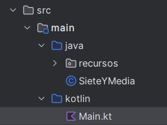

# SieteYMediaJavaUIgraficoKTEnunciado
En una tarea anterior hiciste un Siete y media escrito en Java. Lo hiciste separando la lógica del juego de su presentación. Por lo tanto, ahora puedes reutilizar la lógica del juego escrita en Java y escribir una nueva presentación. En esta tareea se pide que reutilizando el código java de la lógica del juego, sin tener que tocar para nada su código, escribas una UI Compose para la interfaz con el usuario. Puede ser todo lo sencilla que quieras.

La aplicación IntelliJ tendrá que ser una aplicación para compose desktop, a la que añadiremos nuestro código java escrito en la tarea anterior dentro de una carpeta que debe llamarse Java para que Gradle funcione correctamente.

La estructura del proyecto tendrá el siguiente aspecto
